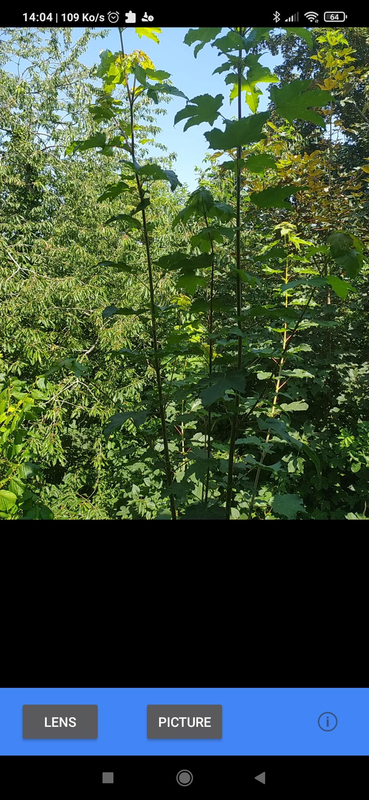
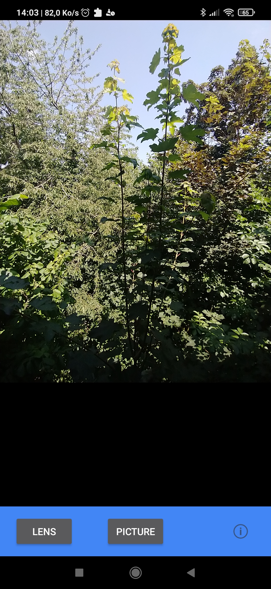

# Xamarin.Android All Cameras

Access all the cameras on your phone (Front, Rear, Macro, Wide, etc ...)

| Rear | Rear wide |
| --- | --- |
|  |  |

## Instructions

- Touch the Picture button to take a photo that will automatically be saved on your device.

- Touch the info button to find out a little bit more about the app.

- Touch the lens button to switch camera.

- Requires a device with a rear facing camera

## Compatibility

| Compatible | Incompatible |
| --- | --- |
| - Xiaomi (Redmi Note 8T) |  |

Do not hesitate to contribute by modifying the file or by opening an issue

## Build Requirements

Using this sample requires a device that is Android L or later and Xamarin.Android 4.17 or later.

## License

Original copyright (c) 2005-2008, The Android Open Source Project  

## Source
[Camera2Basic](https://github.com/xamarin/monodroid-samples/tree/master/android5.0/Camera2Basic)
